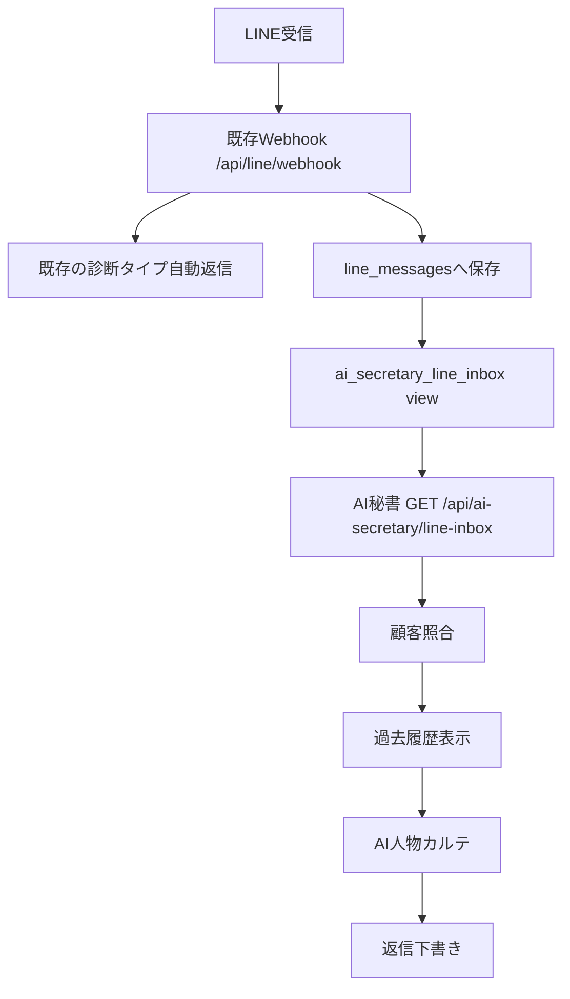

# LINE既存Webhook AI秘書接続 調査メモ

## 結論

既存の `soccer-diagnosis` Webhookは活用できる。

ただし現状の `/api/line/webhook` は、LINE受信内容をSupabaseへ保存していない。診断タイプ名をLINEで受け取り、タイプ別の定型文をLINE Reply APIで即時返信するだけの実装。

AI秘書へつなぐには、既存Webhook内でLINE受信内容をSupabaseへ保存し、AI秘書がそのSupabaseデータを読み取る構成が安全。

## 既存Webhook

| 項目 | 内容 |
|---|---|
| URL | `https://soccer-diagnosis.vercel.app/api/line/webhook` |
| 実装ファイル | `app/api/line/webhook/route.ts` |
| 接続LINE公式 | サッカー家庭教師 |
| Channel ID | `2002055107` |
| Bot Basic ID | `@gnf9264z` |
| LINE導線 | `https://lin.ee/RfP779J` |

## `/api/line/webhook` の受信内容

LINE Messaging APIのWebhookイベントを受ける。

主に利用している項目:

| 項目 | 用途 |
|---|---|
| `event.type` | `message` のみ処理 |
| `event.message.type` | `text` のみ処理 |
| `event.message.text` | 診断タイプ抽出、AI秘書保存対象 |
| `event.message.id` | LINEメッセージID。重複防止に利用可能 |
| `event.source.userId` | LINE userId。顧客候補照合に利用可能 |
| `event.replyToken` | 既存のLINE自動返信に利用 |
| `event.timestamp` | 受信日時 |

## 現在の保存先

現状コードではLINE受信内容の保存先はない。

既存の保存処理:

| データ | 保存先 |
|---|---|
| 診断結果 | `diagnosis_results` |
| 診断ユーザー候補 | `users` |
| LINE受信メッセージ | 保存なし |
| 問い合わせ本文 | メール送信のみ。DB保存なし |
| 予約情報 | 保存なし |

## 顧客識別方法

現状の顧客識別は弱い。

| 方法 | 現状 |
|---|---|
| LINE userId | `users.line_user_id` カラムはあるが、Webhookでは保存・照合していない |
| 診断ID | LINE CTAでユーザーがコピーする文面に含まれる |
| 氏名 | `users.name` カラムはあるが、診断時は未入力が多い |
| メール | `users.email` カラムはあるが、診断時は未入力が多い |
| 電話番号 | なし |
| 予約 | なし |

## Supabase構造

リポジトリ上のスキーマに存在するテーブル:

| テーブル | 内容 |
|---|---|
| `diagnosis_results` | 診断結果 |
| `users` | 診断ユーザー候補、LINE userId、成約ステータス |
| `diagnosis_tags` | 診断タグ正規化 |
| `line_delivery_logs` | LINE配信ログ |
| `case_links` | 症例カルテ閲覧ログ |
| `conversion_status` | 成約ステータス履歴 |
| `staff_notes` | スタッフメモ |

未確認・スキーマ上は存在しないテーブル:

| テーブル | 状態 |
|---|---|
| `messages` | なし |
| `contacts` | なし |
| `reservations` | なし |

## 現在保存されている問い合わせデータ

現時点では取得できていない。

理由:

- 本番 `https://soccer-diagnosis.vercel.app/api/debug-env` はSupabase URLを返す。
- しかし `POST /api/diagnosis` は `{"error":"DB未設定"}` を返した。
- つまり本番Vercel上では `SUPABASE_SERVICE_ROLE_KEY` が未設定、または利用不能。
- SupabaseプロジェクトURL `https://szfcnskdcjexotpywhrh.supabase.co` はこの環境からDNS解決できず、REST件数確認も不可。

現時点で確定できること:

| 項目 | 状態 |
|---|---|
| 診断保存API | 本番で `DB未設定` |
| LINE受信保存 | 現状なし |
| 問い合わせ本文DB保存 | 現状なし |
| 取得可能期間 | 不明 |
| 取得可能項目 | スキーマ上は診断結果・ユーザー情報のみ |

## 追加したAI秘書接続設計

既存Webhookを維持しながら、LINE受信内容をSupabaseに保存する。

## 追加テーブル

`supabase/migrate-line-ai-secretary-intake.sql` を追加。

追加される主な保存項目:

| 項目 | 内容 |
|---|---|
| `account_key` | LINE公式アカウント識別 |
| `line_user_id` | LINE userId |
| `line_message_id` | LINEメッセージID |
| `body` | 受信本文 |
| `extracted_type` | 診断タイプ |
| `intent` | 問い合わせ種別 |
| `ai_summary` | AI秘書用要約 |
| `ai_reply_draft` | 谷田部確認用返信下書き |
| `matched_user_id` | 既存 `users.id` との照合結果 |
| `raw_event` | LINEイベント全文 |
| `status` | `needs_review`, `matched`, `ignored`, `handled` |

## 認証が必要なもの

| 作業 | 必要な認証 |
|---|---|
| 本番Supabaseの件数確認 | Supabaseログイン、または有効なService Role Key |
| 本番Vercel環境変数確認 | Vercelログイン |
| 本番デプロイ | GitHub/Vercel連携 |
| LINE署名検証の本番確認 | LINE Channel secret |

## 次の実装

1. Vercelに `SUPABASE_SERVICE_ROLE_KEY` が設定されているか確認。
2. Supabaseに `migrate-line-ai-secretary-intake.sql` を適用。
3. 本番WebhookでLINE受信が `line_messages` に保存されることを確認。
4. AI秘書から `/api/ai-secretary/line-inbox` を読み取り。
5. 顧客照合・AI人物カルテ・返信下書きをAI秘書側で強化。
